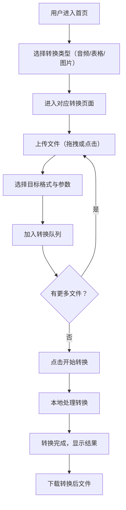

## 1. 产品概述

一款纯本地离线运行的跨平台格式转换工具，支持PC端（浏览器PWA）和安卓端（浏览器PWA）使用。无需联网，所有文件处理均在本地完成，保障用户数据隐私安全。覆盖音频、表格、图片三大类格式的互转需求。

## 2. 核心功能

### 2.1 功能模块

1. **音频格式转换**：主流音乐格式（FLAC、WAV、AAC、OGG、WMA、M4A等）互转MP3或无损格式
2. **表格格式转换**：XLSX、CSV、ODS、HTML表格等格式互相转换
3. **图片格式转换**：PNG、JPEG、WEBP、BMP、GIF、TIFF、SVG、ICO等格式互相转换

### 2.2 页面详情

| 页面名称 | 模块名称 | 功能描述 |
|---------|---------|---------|
| 首页 | 功能导航区 | 三大转换功能入口卡片，点击进入对应转换页面 |
| 首页 | 使用说明区 | 简要说明离线转换特性与支持的格式列表 |
| 音频转换页 | 文件上传区 | 支持拖拽或点击上传音频文件，显示文件信息（名称、大小、当前格式） |
| 音频转换页 | 目标格式选择 | 选择目标格式：MP3、FLAC、WAV、AAC、OGG等，支持比特率/质量参数调节 |
| 音频转换页 | 转换队列 | 多文件批量转换列表，显示转换进度与状态 |
| 音频转换页 | 下载操作 | 单文件下载或批量打包下载 |
| 表格转换页 | 文件上传区 | 支持拖拽或点击上传表格文件，预览表格内容 |
| 表格转换页 | 目标格式选择 | 选择目标格式：XLSX、CSV、ODS、HTML |
| 表格转换页 | 转换队列 | 批量转换列表，显示进度与状态 |
| 表格转换页 | 下载操作 | 单文件下载或批量打包下载 |
| 图片转换页 | 文件上传区 | 支持拖拽或点击上传图片，显示缩略图预览 |
| 图片转换页 | 目标格式与参数 | 选择目标格式（PNG/JPG/WEBP等），调整质量/尺寸参数 |
| 图片转换页 | 转换队列 | 批量转换列表，显示进度与状态 |
| 图片转换页 | 下载操作 | 单文件下载或批量打包下载 |

## 3. 核心流程

## 4. 用户界面设计

### 4.1 设计风格

- **主题**：深色科技风，传达专业、安全、高效的品牌感受
- **主色**：深蓝黑背景（#0f1724），青蓝色强调色（#00d4ff），渐变紫辅助色（#7c3aed）
- **字体**：标题使用"Orbitron"（科技感），正文使用"Noto Sans SC"（中文可读性）
- **布局**：桌面端采用侧边导航 + 主内容区，移动端底部导航栏
- **按钮**：圆角矩形，带微弱发光效果（neon glow），悬停时亮度增强
- **图标**：使用 Lucide Icons 线性图标，与科技风协调
- **动效**：页面切换淡入过渡，卡片悬停微浮起，转换中脉冲动画

### 4.2 页面设计概览

| 页面名称 | 模块名称 | UI元素 |
|---------|---------|--------|
| 首页 | 导航栏 | 顶部Logo + 标题，简洁无多余元素 |
| 首页 | 功能卡片区 | 三张大卡片居中排列，每张有对应图标、标题、支持的格式标签，悬停发光边框 |
| 首页 | 底部信息 | 离线标识、无需联网提示 |
| 转换页 | 上传区 | 大面积虚线框拖拽区，中央上传图标，支持格式文字提示 |
| 转换页 | 格式选择栏 | 水平排列的格式按钮组，选中项高亮发光 |
| 转换页 | 转换队列 | 列表形式，每项显示文件名、当前格式→目标格式、进度条、状态图标 |
| 转换页 | 操作栏 | 底部固定栏，开始转换按钮、清空按钮、下载全部按钮 |

### 4.3 响应式设计

- **桌面端（≥1024px）**：侧边功能导航固定左侧，主内容居中最大宽度960px
- **平板端（768-1023px）**：顶部标签式导航，内容区全宽
- **手机端（<768px）**：底部Tab导航，上传区全屏，队列列表紧凑排列
- 所有拖拽区域支持触摸操作（移动端）

## 5. 技术约束

- 纯前端，无后端服务
- 所有处理在浏览器本地完成（Web Worker + WebAssembly）
- PWA模式支持离线使用、可安装到桌面/主屏幕
- 文件不离开用户设备，保障隐私安全
