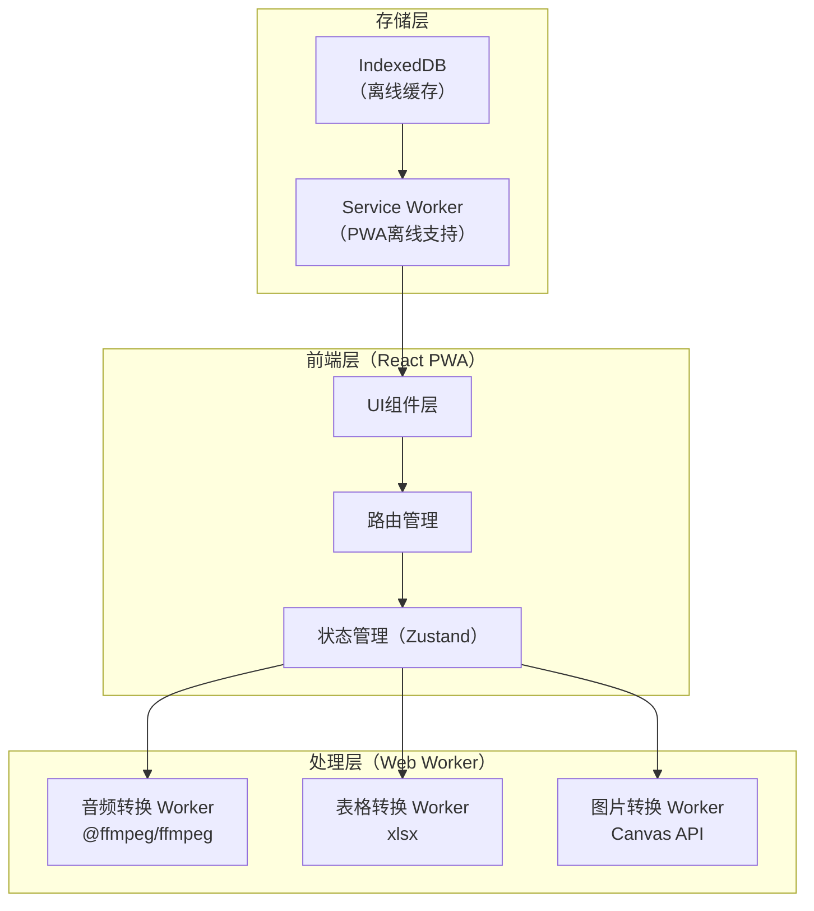

## 1. 架构设计



## 2. 技术选型

| 层级     | 技术                           | 说明                            |
| ------ | ---------------------------- | ----------------------------- |
| 前端框架   | React 18 + TypeScript        | 类型安全，生态丰富                     |
| 构建工具   | Vite 5                       | 快速开发构建，PWA插件支持                |
| 样式方案   | TailwindCSS 3                | 高效样式开发                        |
| 路由     | React Router v6              | SPA路由管理                       |
| 状态管理   | Zustand                      | 轻量级状态管理                       |
| 音频转换   | @ffmpeg/ffmpeg (WebAssembly) | 浏览器端FFmpeg，支持所有主流音频格式         |
| 表格转换   | xlsx (SheetJS)               | 纯JS表格读写，支持XLSX/CSV/ODS        |
| 图片转换   | 浏览器原生Canvas API              | 无需额外库，支持PNG/JPEG/WEBP/BMP     |
| 图片高级格式 | browser-image-compression    | 补充格式支持                        |
| PWA    | vite-plugin-pwa              | Service Worker + Manifest自动生成 |
| 图标     | lucide-react                 | 轻量线性图标库                       |
| 打包下载   | jszip                        | 批量文件打包为ZIP下载                  |

## 3. 路由定义

| 路由     | 页面   | 说明      |
| ------ | ---- | ------- |
| /      | 首页   | 功能导航入口  |
| /audio | 音频转换 | 音频格式转换页 |
| /sheet | 表格转换 | 表格格式转换页 |
| /image | 图片转换 | 图片格式转换页 |

## 4. 数据模型

### 4.1 转换任务模型（TypeScript）

```typescript
// 转换类型
type ConvertType = 'audio' | 'sheet' | 'image';

// 音频目标格式
type AudioTargetFormat = 'mp3' | 'flac' | 'wav' | 'aac' | 'ogg' | 'm4a';

// 表格目标格式
type SheetTargetFormat = 'xlsx' | 'csv' | 'ods' | 'html';

// 图片目标格式
type ImageTargetFormat = 'png' | 'jpeg' | 'webp' | 'bmp' | 'ico';

// 转换任务状态
type TaskStatus = 'pending' | 'converting' | 'done' | 'error';

// 单个转换任务
interface ConvertTask {
  id: string;
  fileName: string;
  fileSize: number;
  sourceFormat: string;
  targetFormat: string;
  status: TaskStatus;
  progress: number;       // 0-100
  error?: string;
  sourceFile: File;
  resultBlob?: Blob;
  resultUrl?: string;
  // 音频参数
  audioBitrate?: string;   // '128k', '256k', '320k'
  audioSampleRate?: number; // 44100, 48000
  // 图片参数
  imageQuality?: number;   // 0.1-1.0
  imageMaxWidth?: number;
  imageMaxHeight?: number;
}

// 转换队列
interface ConvertQueue {
  type: ConvertType;
  tasks: ConvertTask[];
  isProcessing: boolean;
}
```

## 5. 离线策略

* **Service Worker**：缓存所有静态资源（HTML/CSS/JS/字体），首次访问后完全离线可用

* **IndexedDB**：缓存转换历史记录（仅元数据，不含文件内容）

* **WebAssembly缓存**：ffmpeg.wasm核心文件通过Service Worker预缓存

* **PWA Manifest**：支持添加到桌面/主屏幕，全屏独立窗口运行

